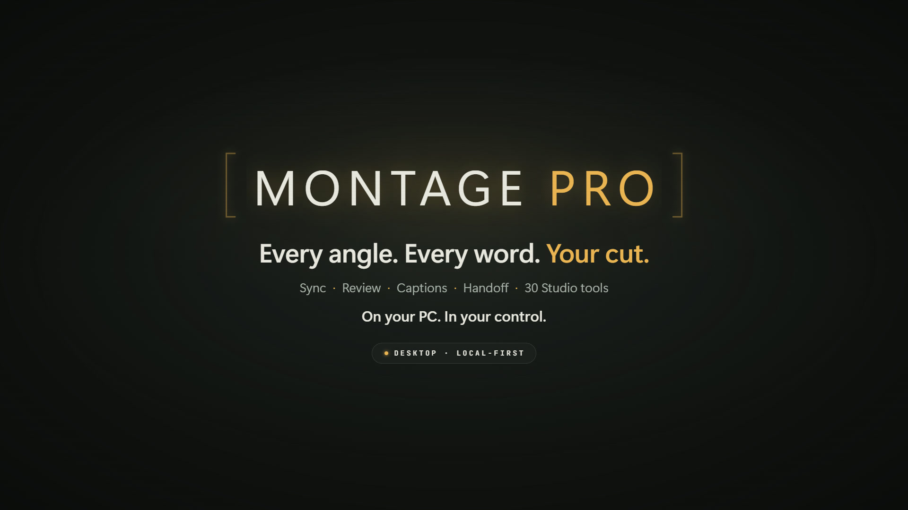
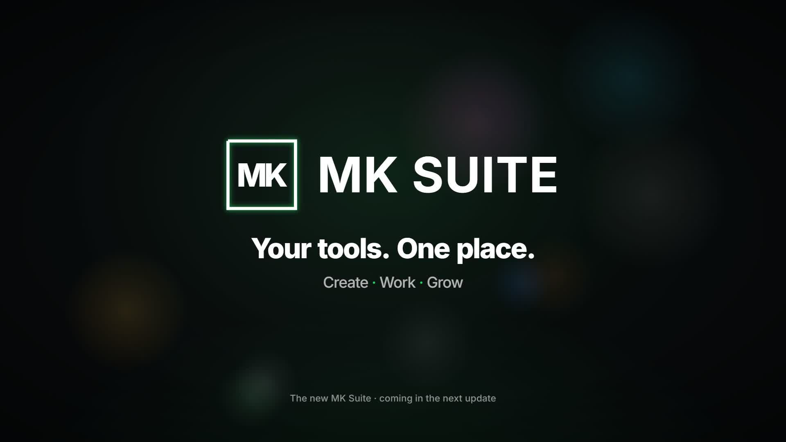
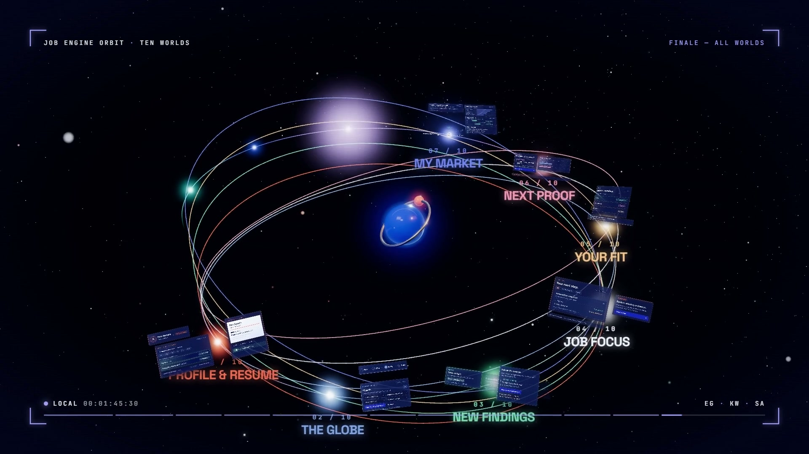
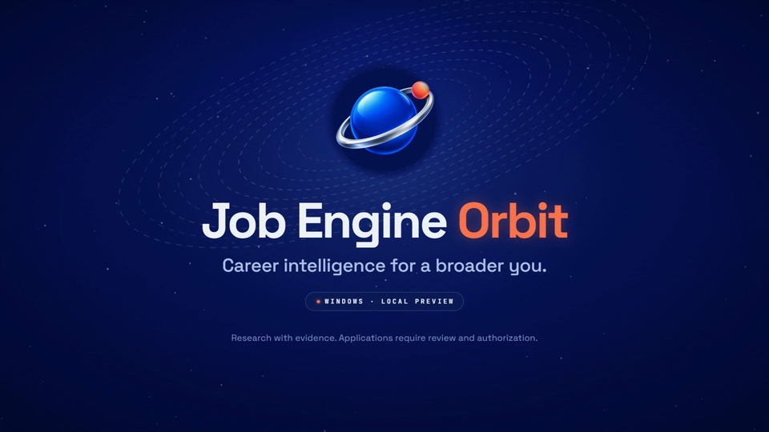
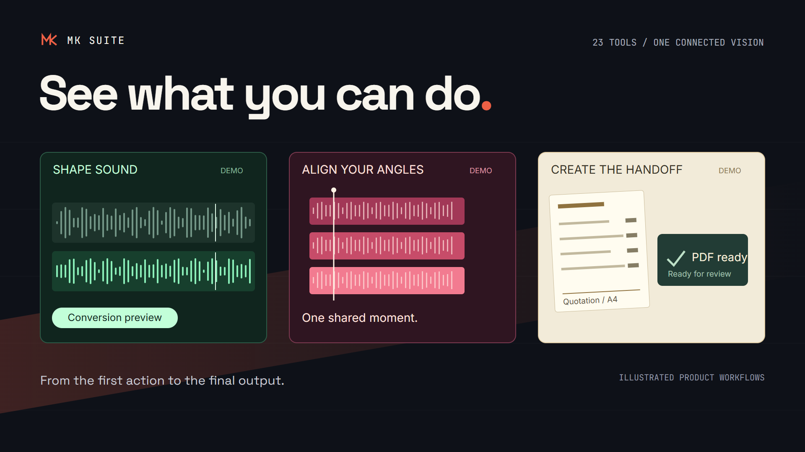
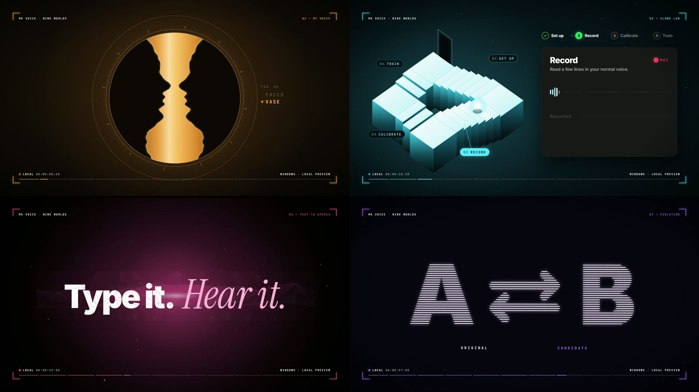
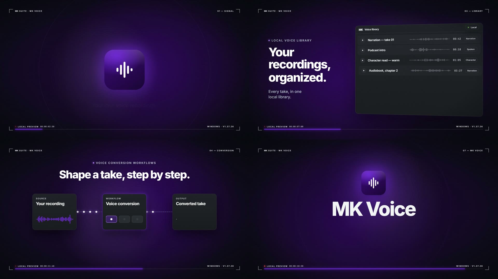
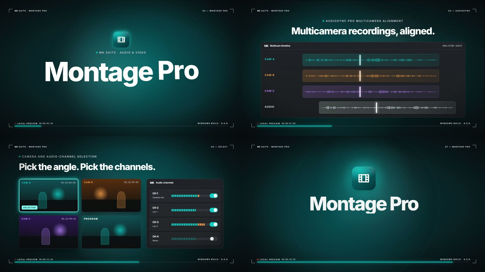
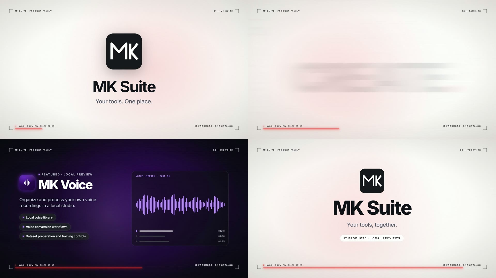

# motion-video-skill

## Montage Pro — eleven worlds

**[Watch / download the 164-second film and editable source](https://github.com/Mohamed3042/motion-video-skill/releases/tag/montage-pro-worlds-v1.0)** · [Chapter player](outputs/montage-pro-worlds/montage-pro-worlds.html) · [Editing guide](docs/montage-pro-worlds/EDITING.md) · [Verification](docs/montage-pro-worlds/PRODUCTION.md)

[](https://github.com/Mohamed3042/motion-video-skill/releases/download/montage-pro-worlds-v1.0/montage-pro-worlds.mp4)

A 1080p60 film with eleven distinct feature worlds, a phase-lock introduction and multicam finale. All 75 declared impact cues pass timing checks within one frame. The release includes the full master and complete standalone source ZIP; [scene source](studio/src/mpw) and [sound source](studio/scripts/mpw) are also committed here. The UI scenes illustrate capabilities, and the verification report records the limits of viewing/listening acceptance.

## MK Suite — launcher launch film

**[Full film, Create preview and editable source ZIP](https://github.com/Mohamed3042/motion-video-skill/releases/tag/mk-suite-launch-2026-10-03)** · [Standalone source and build instructions](films/mk-suite-launch/README.md) · [Sampled visual review](films/mk-suite-launch/evidence/visual-review.md)

[](https://github.com/Mohamed3042/motion-video-skill/releases/tag/mk-suite-launch-2026-10-03)

The completed 120-second 1080p60 launch film presents the reimagined launcher through its 31 design screens. It preserves the existing seven-act direction, with completed Reveal sound cues, corrected Create search framing, and an original score. The closing card identifies the launcher as coming in the next update.

The master decodes through all 7,200 frames; its 67 declared impact/title/key/click onsets pass within one frame. Exported audio measures −14.2 LUFS and −2.3 dBTP. Visual review uses sampled frames and transition strips; continuous human viewing and listening are not claimed. Earlier MK Suite films and the other product projects are preserved.

## MK Job Orbit v2 — The Flight

**[Watch / download the continuous 3D flight and editable ZIP](https://github.com/Mohamed3042/motion-video-skill/releases/tag/job-orbit-v2.0)** · [Player source](outputs/job-orbit-v2/index.html) · [Editing guide](docs/job-orbit-v2/EDITING.md) · [Verification](docs/job-orbit-v2/PRODUCTION.md)

**[Explore the scrolling Job Orbit software page](https://mohamed3042.github.io/flagship-portfolio-v3/en/work/job-orbit/)** · [العربية](https://mohamed3042.github.io/flagship-portfolio-v3/ar/work/job-orbit/)

[](https://github.com/Mohamed3042/motion-video-skill/releases/download/job-orbit-v2.0/MK-Job-Orbit-v2-Share-1080p60.mp4)

A continuous 120-second, 1080p60 camera flight through ten distinct 3D stations. The finished source and illustrated product workflows are preserved; V1 remains available below. The release includes the 248.4 MB master, 97.7 MB sharing copy and standalone editable source with its actual synthesized score.

Both exported movies pass complete decoding and all 65 declared audio-impact checks. Sampled visual review covered 151 source frames, 20 master frames and four sharing frames; minor margin drift during late motion was retained. Audio was measured, not listened to. The interfaces and records are fictional illustrative animation, not live product recordings.

## MK Job Orbit — ten feature worlds

**[Watch / download the 120-second film and editable ZIP](https://github.com/Mohamed3042/motion-video-skill/releases/tag/job-orbit-v1.0)** · [Chaptered local player](outputs/job-orbit/index.html) · [Editing guide](docs/job-orbit/EDITING.md) · [Verification](docs/job-orbit/PRODUCTION.md)

[](outputs/job-orbit/job-orbit-share.mp4)

A 1080p60 journey from job-search overload through profile evidence, the globe, findings, focus, fit, next proof, market research, employers, agents and the private phone companion. Each world has its own optical illusion, accent and musical arrangement. The 18.9 MB repository preview is 720p60; the release contains the 1080p60 master and complete standalone source ZIP.

All 65 declared sound cues pass timing checks within one frame. The interfaces use fictional examples and illustrate capabilities; they are not live product recordings. Audio was measured, not listened to. See the [product truth notes](docs/job-orbit/PRODUCT-TRUTH.md) and [sampled visual review](docs/job-orbit/PRODUCTION.md).

## MK Suite product workflow film

**[Watch / download the upgraded 90-second film](https://github.com/Mohamed3042/motion-video-skill/releases/tag/mk-suite-film-v2)** · [Chaptered local player](outputs/mk-suite-workflows/index.html) · [Verification](docs/mk-suite/PRODUCTION.md)

[](outputs/mk-suite-workflows.mp4)

The new MK Suite film demonstrates 23 products through animated inputs, controls and outcomes. The complete editable project is included: [AI editing guide](docs/mk-suite/EDITING.md), [V2 brief](briefs/mk-suite-workflows.md), [visual source](studio/src/mk-suite-workflows), [sound source](studio/scripts/mk-suite-workflows), and [production tools](tools/mk-suite).

From this repository's root, run `npm run setup`, `npm run music`, `npm run check`, then `npm run dev`. Run `npm run render` for the 90-second 1080p60 movie. V1 is preserved under `studio/src/mk-suite-worlds/`. These are illustrated product workflows using demo data; product availability varies.

**Using the film source ZIP?** It contains the complete MK Suite V1/V2 film project and the commands above. The upstream templates, orchestrator, runner and example movies described below belong to the full GitHub repository and are intentionally outside that film archive. Follow `docs/mk-suite/EDITING.md` for the archive's standalone entry points.

**An AI-agent skill for making motion-graphics videos where every frame and every sound is code.**

You give an agent an idea, a length in seconds and your brand, and it hands back a finished 1080p60 MP4:
- the picture is drawn in [Remotion](https://www.remotion.dev) (React)
- the music is synthesized from scratch in Node
- every hit lands on its exact frame

The skill works with Claude Code, OpenAI Codex, Gemini CLI, and, through the bundled runner, the Grok, DeepSeek and Gemini APIs. See [`docs/USING-WITH-AGENTS.md`](docs/USING-WITH-AGENTS.md).

## Made with this skill

[](outputs/mk-voice-worlds.mp4)

**[MK Voice: Nine Worlds](outputs/mk-voice-worlds.mp4)** is a 90 s feature tour where every feature is its own world, with its own color, optical illusion and music style:
- Rubin's vase
- a Penrose staircase paired with an endlessly rising Shepard–Risset tone
- peripheral drift
- anamorphic type
- a Droste zoom
- a scintillating grid
- a moiré reveal
- a Necker cube
- Kanizsa contours

It was built by 5 parallel agents on one shared timing contract: all 47 sound hits land within ±1 frame, and the nine worlds are loudness-matched to within 0.3 LU. Brief: [`briefs/mk-voice-worlds.md`](briefs/mk-voice-worlds.md).

| | |
|---|---|
| [](outputs/mk-voice.mp4) **[MK Voice](outputs/mk-voice.mp4)**: 20 s product reel | [](outputs/mk-montage.mp4) **[Montage Pro](outputs/mk-montage.mp4)**: 20 s product reel |
| [](outputs/mk-suite.mp4) **[MK Suite](outputs/mk-suite.mp4)**: 20 s product-family reel | |

Every video above is 1920×1080 at 60 fps. Each has its own soundtrack generated in code, mastered to −14 LUFS, and hit-synced to ±1 frame. No stock footage, samples or After Effects were used.

## How it works

1. **Ask:** the agent asks how many **seconds** you want (always), plus the format, brand and style if they're missing.
2. **Brief:** it writes a scene-by-scene plan to `briefs/<slug>.md` (palette, fonts, scenes with exact second ranges, music cues, truthfulness rules).
3. **Template:** it copies the closest template in `studio/src/` instead of starting from zero.
4. **One timing file:** scene bounds and every sound event live in a single `.ts` module. Both the React scenes and the Node synth import it, which is why sound and picture can't drift.
5. **Music in code:** oscillators, FM, noise, reverb and a limiter → a WAV at −14 LUFS with true peak below −1 dBTP. An onset check fails the build if any impact is more than ±1 frame off.
6. **Look before rendering:** the agent renders stills of every scene, looks at them, fixes layout and legibility, then renders the MP4. It checks the result with ffprobe and makes a share copy.

## Templates

| Template | Use it for |
|---|---|
| [`studio/src/mk`](studio/src/mk) | Product and UI promos; several reels sharing one design system (cards, pills, waveforms, timelines, end cards) |
| [`studio/src/mkv`](studio/src/mkv) | Long feature tours where **every feature is its own world**, with its own color, optical illusion and music style. A framework provides portals between worlds, a per-world HUD, an intro, a finale montage and a master mix. |
| [`studio/src/opus`](studio/src/opus) | Glossy 3D: a refractive glass sphere, mirror floor, extruded 3D type, shape morphs, particles forming text, one continuous camera move, a seamless loop |

## Quick start

```bash
git clone https://github.com/Mohamed3042/motion-video-skill
cd motion-video-skill/studio
npm install
```

You need Node.js 22+ and ffmpeg/ffprobe on your PATH. Then open the repo root in your agent and say, for example: *"make a 30 second promo for my app"*.

Re-render an included video yourself:

```bash
cd studio
node scripts/mk/music.ts
npx remotion render src/index.ts MkVoice ../outputs/mk-voice.mp4
```

`node scripts/mk/music.ts` regenerates the music WAVs, which aren't stored in git.

## Orchestrator: a team of agents

[`orchestrator/`](orchestrator/README.md) runs the skill as a team:
- a **director** plans the video
- **builders** make the segments in parallel
- a **reviewer** checks the stills
- an **escalation** model retakes failing jobs

You choose the model for each role. It can be on any provider, a free tier, a local model, or the agent you're already using. Automatic gates check every job, and a budget cap applies. The orchestrator works with any AI and can be driven by any AI: through an MCP server (Claude Code, Codex, Gemini CLI, Cursor, Claude Desktop), an HTTP JSON API, or the `mvo` CLI. A local dashboard is included too.

```bash
cd orchestrator && npm install && node bin/mvo.ts dashboard
```

## Repo layout

```
skills/motion-video/SKILL.md   the skill (Agent Skills format: works in Claude Code, Codex, Gemini CLI, …)
AGENTS.md · CLAUDE.md · GEMINI.md   auto-loaded agent instructions (all point to the skill)
agent/run.mjs                  runner for API-only models (DeepSeek, Grok, Gemini API, any OpenAI-compatible)
docs/USING-WITH-AGENTS.md      setup for each agent and provider
studio/                        Remotion project + templates + music/check/stills scripts
briefs/                        the briefs behind the included videos
outputs/                       rendered videos + contact sheets
```

## Notes

- **Remotion licence:** Remotion has its own licence. It's free for individuals and small teams; larger companies need a company licence. See [remotion.dev/license](https://www.remotion.dev/license).
- **Font licences:** fonts load from Google Fonts. `studio/public/opus/fonts/Nunito-Black.ttf` is under the SIL Open Font License.
- **Code licence:** the code is MIT-licensed (see [LICENSE](LICENSE)). The MK Suite and MK Voice names, brands and the videos in `outputs/` belong to their owner; they're included as examples and aren't licensed for reuse.

## Montage Pro — phone edition

The completed desktop Eleven Worlds film has a native **1080 × 1920, 164-second, 60 fps** companion. All eleven feature worlds, the intro and finale are composed for portrait, with the original score and chapter boundaries. See [the phone editing guide](docs/montage-pro-phone/README.md) and [the master and editable source release](https://github.com/Mohamed3042/motion-video-skill/releases/tag/montage-pro-phone-v1.0). The desktop master and source are preserved.
